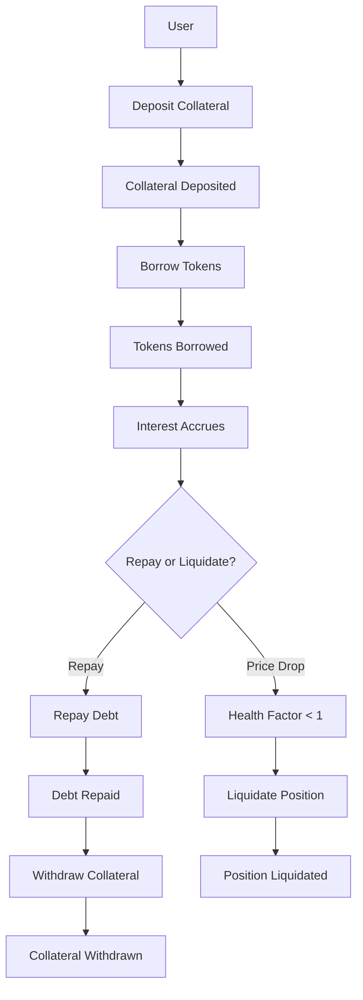

# Lending Pool Workflow

```mermaid
flowchart TD
    A[User] --> B[Deposit Collateral]
    B --> C[Collateral Deposited]
    C --> D[Borrow Tokens]
    D --> E[Tokens Borrowed]
    E --> F[Interest Accrues]
    F --> G{Repay or Liquidate?}
    G -->|Repay| H[Repay Debt]
    H --> I[Debt Repaid]
    I --> J[Withdraw Collateral]
    J --> K[Collateral Withdrawn]
    G -->|Price Drop| L[Health Factor < 1]
    L --> M[Liquidate Position]
    M --> N[Position Liquidated]
```